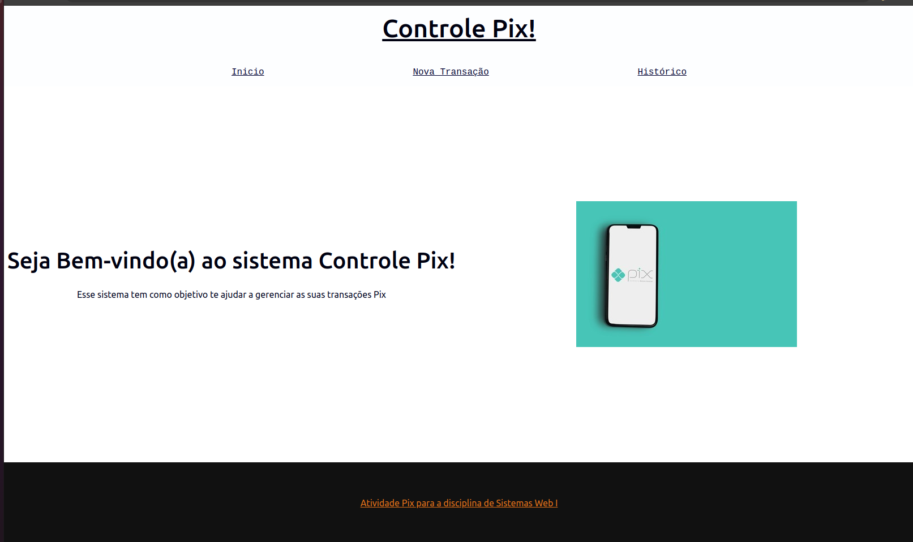
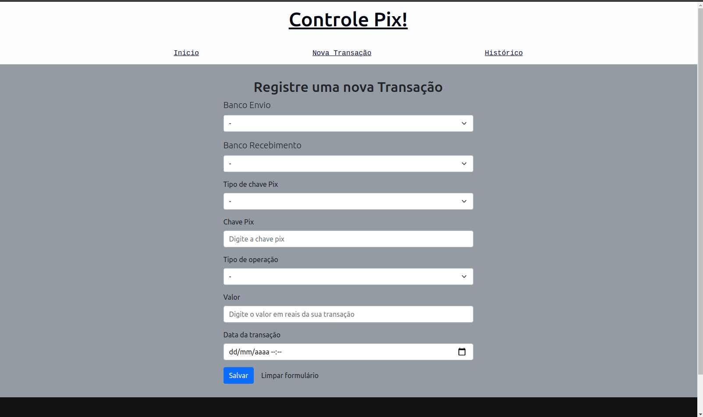
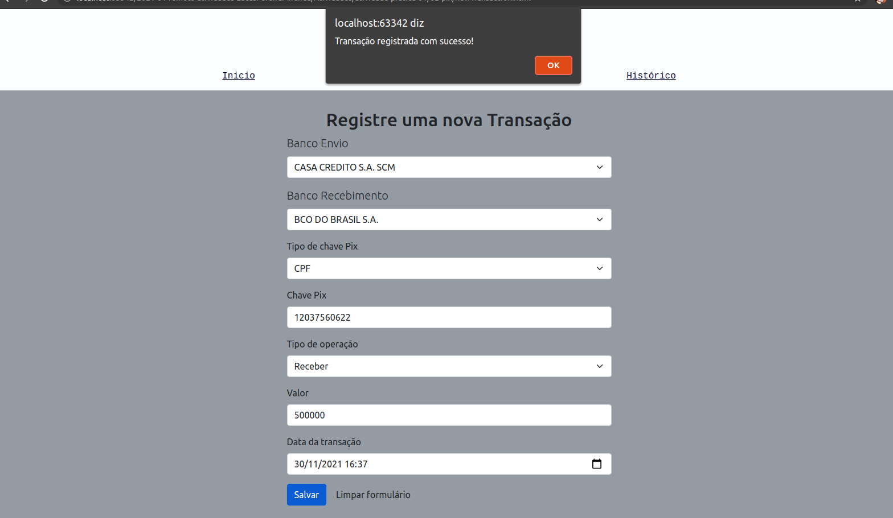
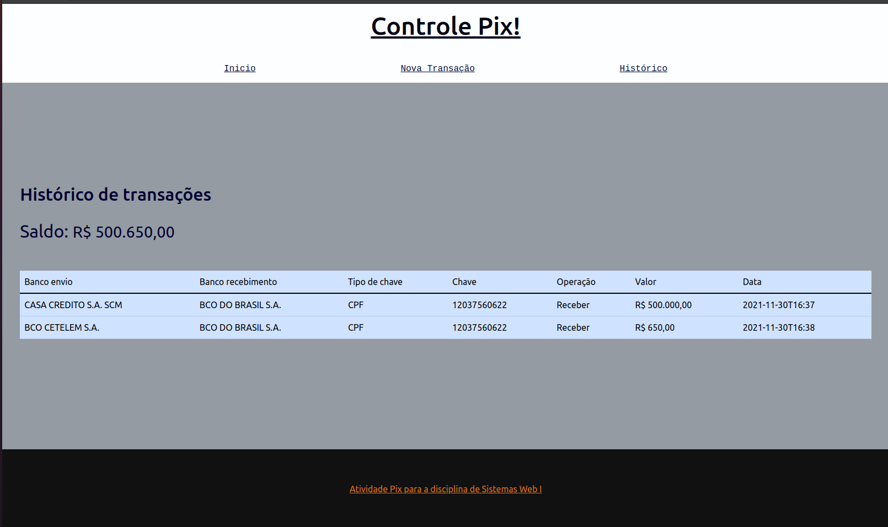

# Controle de Pix

Dados do aluno:
* Nome: Lucas Pereira Miranda
* Matrícula: 17.2.8207
* Curso: Engenharia de Computação

Descrição:

Projeto de um sistema de controle de pix para a atividade prática 1 de sistemas Web.
O projeto utiliza o localStorage do navegador para manter informações temporariamente sobre as transações.

Imagens do projeto em execução:

Página inicial:

Página de registro de transações:

Transação registrada com sucesso:

Saldo total e histórico de transações:

Referências:

Aquivo de Reset css utilizado:

- http://meyerweb.com/eric/tools/css/reset/ 
v2.0 | 20110126
License: none (public domain)
