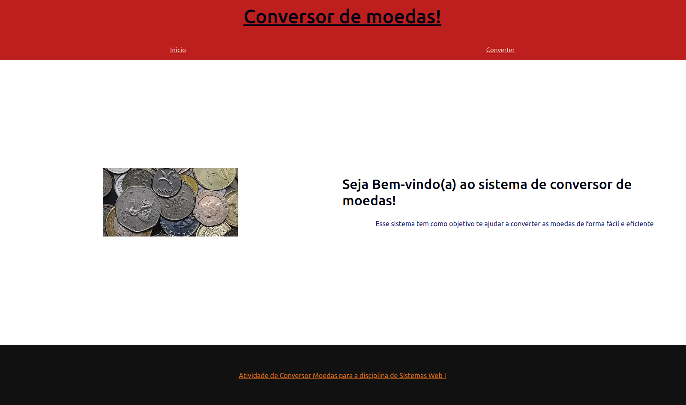
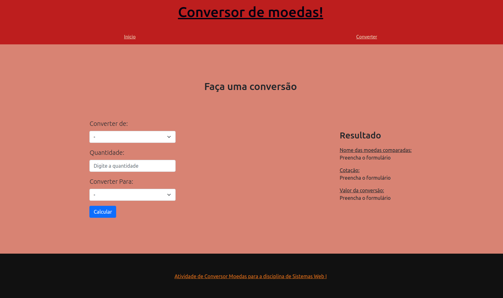

# Conversor de moedas

Dados do aluno:
* Nome: Lucas Pereira Miranda
* Matrícula: 17.2.8207
* Curso: Engenharia de Computação

Descrição:

Projeto de um sistema de conversão de moedas para a atividade prática 1 de sistemas Web.
Limitação: O projeto sente instabilidades quando a api de moedas não retorna o valor para realizar a conversão.

Imagens do projeto em execução:

Página inicial:

convertendo moedas:

Aquivo de Reset css utilizado:

- http://meyerweb.com/eric/tools/css/reset/ 
v2.0 | 20110126
License: none (public domain)
